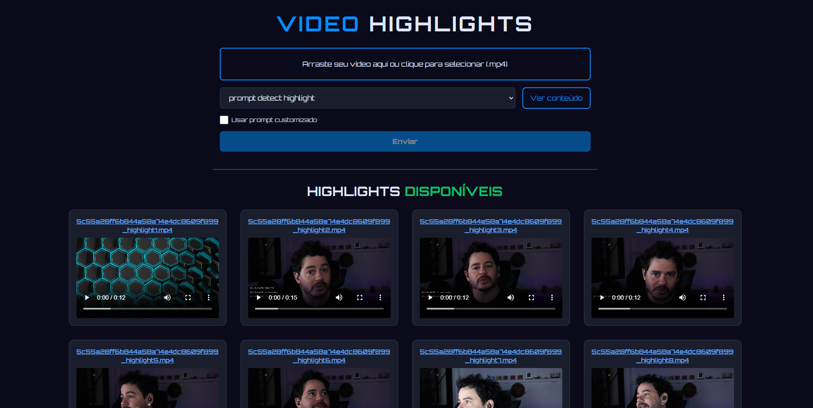

# Video Highlight Cutter

Um webapp simples e prático para **upload de vídeos (.mp4)**, extração automática de **highlights** (momentos importantes) e **download/visualização** dos cortes diretamente pelo navegador.  
Agora com **opção de seleção de prompt** para personalizar a detecção de highlights e **layout otimizado** para exibir até 4 vídeos por linha.

---

## 🚀 Como funciona

1. **Upload:** Envie um vídeo `.mp4` pela interface web.
2. **Escolha do prompt:** Selecione um prompt pré-configurado ou ative a opção de **prompt customizado** para usar seu próprio texto.
3. **Processamento:** O sistema extrai o áudio, faz transcrição automática (Whisper), detecta os highlights via IA (Ollama) e corta os trechos relevantes.
4. **Acompanhamento em tempo real:** Os highlights aparecem organizados na página, com até 4 vídeos por linha, prontos para assistir, baixar ou compartilhar enquanto o processamento ocorre.

---

## 💻 Exemplo da interface

Veja como é fácil acompanhar o processo:



---

## 🛠️ Principais Tecnologias

- **Python FastAPI** (backend web)
- **MoviePy** & **Whisper** (processamento e transcrição)
- **Ollama** (IA para seleção dos melhores highlights)
- **Jinja2** (frontend dinâmico)
- **TailwindCSS** (layout responsivo)
- **JavaScript** (atualização dinâmica de status e seleção de prompt)

---

## 🐳 Como subir rapidamente (Recomendado - Docker)

A forma mais fácil e recomendada para rodar todo o sistema é via **Docker Compose**, pois já integra todos os serviços necessários (webapp, Whisper, Ollama).  
Siga os passos:

```bash
# 1. Crie a rede docker (apenas na primeira vez)
docker network create app-network

# 2. Suba todos os serviços (webapp, Whisper e Ollama)
docker compose up --build -d

# 3. Acesse normalmente em
http://localhost:8000
```

> **Obs:** O processamento usa IA e pode demorar alguns minutos conforme o vídeo e seu hardware.

---

## 👨‍💻 Rodando manualmente (Desenvolvedores/Avançado)

> ⚠️ **Atenção:** Para uso real, sempre prefira a versão Docker acima!  
> Rodar localmente sem containers requer que você tenha o Whisper e o Ollama configurados separadamente.

Para desenvolvedores que desejam rodar *apenas o webapp*:

```bash
# Instale as dependências Python
pip install -r requirements.txt

# Inicie o servidor web
uvicorn webapp:app --reload --host 0.0.0.0 --port 8000

# Abra o navegador em
http://localhost:8000
```

> Isso sobe apenas a interface web.  
> Para processamento real, os serviços de IA precisam estar rodando conforme no docker-compose!

---

## 📂 Estrutura do Projeto

- Os arquivos processados ficam na pasta `processed/`
- Highlights podem ser baixados em `.mp4`
- Transcrições e cortes intermediários também são salvos
- Interface exibe **até 4 vídeos por linha** para melhor aproveitamento do espaço

---

## ⚡ Exemplos de comandos úteis

```bash
# Extrai highlights do vídeo usando um arquivo de legendas já transcrito:
python detect_highlight.py seu_video.srt prompt_detect_highlight.txt
# Gera: seu_video.highlight.json (lista de cortes sugeridos)

# Classifica os cortes usando IA:
python classify_segments.py seu_video.srt seu_video.highlight.json prompt_classify.txt
# Gera: seu_video.highlight.classified.json

# Filtra os melhores highlights:
python filter_highlights.py seu_video.highlight.classified.json seu_video.highlight.filtered.json

# Corta os highlights finais do vídeo original:
python cut_highlight.py seu_video.mp4 seu_video.highlight.filtered.json
# Gera arquivos highlight: seu_video_highlight1.mp4, etc.
```

---

## 🐳 docker-compose.yaml (resumido)

```yaml
services:
  video-highlight-cutter:
    build: .
    container_name: video-highlight-cutter
    env_file:
      - .env
    ports:
      - "8000:8000"
    restart: always
    tty: true
    stdin_open: true
    volumes:
      - ./app:/app
    networks:
      - default
    working_dir: /app
    depends_on:
      - whisper
      - ollama

  whisper:
    image: onerahmet/openai-whisper-asr-webservice:v1.9.1
    container_name: whisper
    restart: unless-stopped
    environment:
      - ASR_MODEL=turbo
      - ASR_ENGINE=openai_whisper
    ports:
      - "9000:9000"
    volumes:
      - cache-whisper:/root/.cache
    networks:
      - default
    healthcheck:
      test: ["CMD", "curl", "-f", "http://localhost:9000"]
      interval: 10s
      timeout: 5s
      retries: 10

  ollama:
    image: ollama/ollama:0.10.1
    container_name: ollama
    restart: always
    ports:
      - "11434:11434"
    volumes:
      - ollama:/root/.ollama
    environment:
      - OLLAMA_MODELS=llama3.2:3b
    healthcheck:
      test: ["CMD", "curl", "-f", "http://localhost:11434"]
      interval: 10s
      timeout: 5s
      retries: 10
    networks:
      - default

networks:
  default:
    external: true
    name: app-network

volumes:
  cache-whisper:
  ollama:
```

---

## 🐍 Dockerfile (resumido)

```dockerfile
FROM python:3.11-slim

RUN apt-get -y update && apt-get -y upgrade && apt-get install -y --no-install-recommends libmediainfo0v5 libmediainfo-dev ffmpeg
RUN python -m pip install --upgrade pip
WORKDIR /app
COPY requirements.txt .
RUN pip install --no-cache-dir -r requirements.txt
COPY ./app .
EXPOSE 8000
CMD ["uvicorn", "webapp:app", "--host", "0.0.0.0", "--port", "8000"]
```

---

## ⚙️ Configuração da IA (Ollama)

O comportamento da IA pode ser ajustado pelo arquivo `.env`.  
Esses parâmetros controlam como o modelo gera as respostas, permitindo mais **precisão** ou mais **criatividade**, conforme a necessidade.

```ini
# ------------------------------
# Toggle do motor de IA
# ------------------------------
# false → usa Ollama local (padrão)
# true  → usa API da OpenAI
USE_CHATGPT=false

# ------------------------------
# Configuração OpenAI (se USE_CHATGPT=true)
# ------------------------------
OPENAI_API_KEY=sk-xxxxxx
OPENAI_MODEL=gpt-4o-mini
OPENAI_TIMEOUT=120

# ------------------------------
# Configuração Ollama (se USE_CHATGPT=false)
# ------------------------------
# TEMPERATURE → controla a aleatoriedade da resposta.
# Baixo (0.1–0.3) = determinístico, mais preciso.
# Alto (0.7–1.0) = criativo, mais variado.
OLLAMA_TEMPERATURE=0.1

# TOP_P → filtro de probabilidade acumulada (Nucleus Sampling).
# Ex.: 0.8 = considera apenas palavras dentro do top 80% de probabilidade.
# Baixo = mais restrito; alto = mais diverso.
OLLAMA_TOP_P=0.8

# TOP_K → limita quantas opções de palavras considerar a cada passo.
# Ex.: 50 = avalia apenas as 50 mais prováveis.
# Baixo = foco; alto = diversidade.
OLLAMA_TOP_K=50

# REPEAT_PENALTY → penaliza repetição de palavras/frases já usadas.
# >1 reduz repetições. Ex.: 1.2 é equilíbrio comum.
OLLAMA_REPEAT_PENALTY=1.2

# NUM_CTX → tamanho do contexto (quantos tokens o modelo "lê").
# Maior = suporta transcrições mais longas, mas exige mais memória.
# 8192 tokens ≈ 6.000 palavras.
OLLAMA_NUM_CTX=16384

# NUM_PREDICT → número máximo de tokens que o modelo pode gerar.
# Ex.: 256 ≈ 200 palavras.
# Útil para limitar saídas longas (ex.: só JSON).
OLLAMA_NUM_PREDICT=1024
```

> 🔧 **Dica prática:**  
> - Para **cortes mais precisos** → use TEMPERATURE baixo (0.1–0.3).  
> - Para **explorar cortes criativos** → aumente TEMPERATURE + TOP_P.  
> - Para vídeos longos → aumente NUM_CTX (se tiver memória suficiente).

---

## ℹ️ Observações

- Os highlights aparecem automaticamente enquanto o processamento ocorre.
- Todos os arquivos processados ficam organizados na pasta `processed/`.
- É possível escolher entre **prompts pré-definidos** ou criar um **prompt customizado**.
- O sistema pode baixar o modelo de IA do Ollama automaticamente, se necessário.

---

## 🤝 Contribua!

Achou algum bug, tem uma sugestão ou quer contribuir?  
Abra uma issue ou PR!
